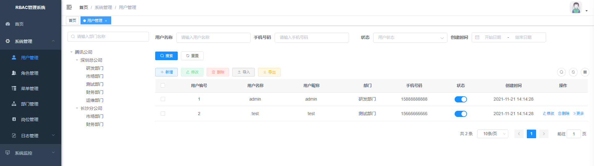
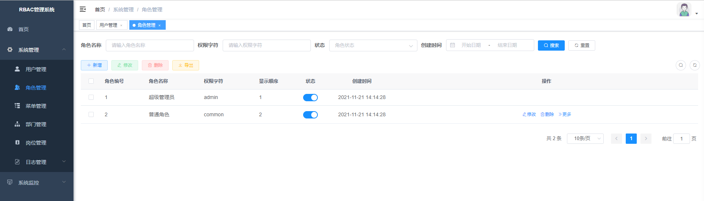
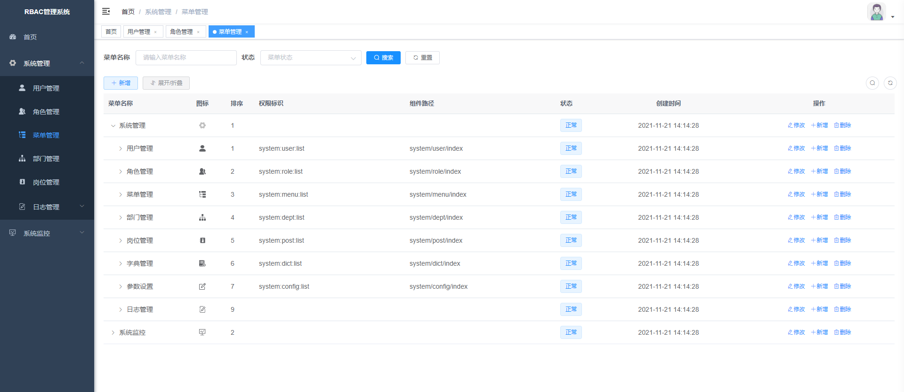
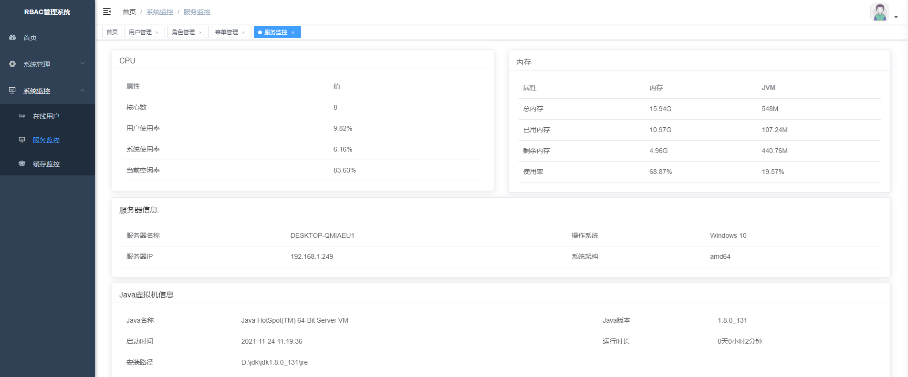
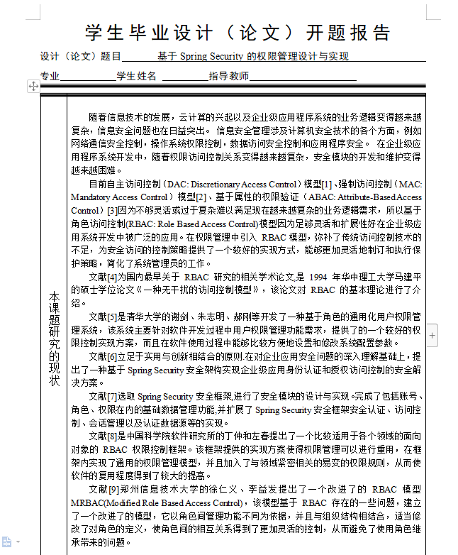

# 毕业设计_权限管理系统

#### 介绍   权限管理系统 springboot +springSecurity + mybatis + mysql8   扣扣  545514807

权限管理系统 
 
参考图片、文献如下:
 
 
 
 
 

##### 软件架构
本系统是基于SpringSecurity+SpringBoot+Mybatis。 SpringSecurity是一个高度自定义的安全框架。利用Spring IoC/DI和AOP功能，为系统提供了声明式安全访问控制功能，减少了为系统安全而编写大量重复代码的工作

技术栈
编辑器
IntelliJ IDEA 2020.1.3 (Ultimate Edition)

前端技术
基础：html+css+JavaScript

框架：
vue + element-ui

后端技术
SpringBoot 2.4.5

SpringSecurity 2.4.5

mybatis 2.2.0

运行环境
redis 3.2.100

数据库：mysql 8

jdk版本：1.8.0_181
gitee地址 https://gitee.com/darlingzhangsh/dashboard/projects
